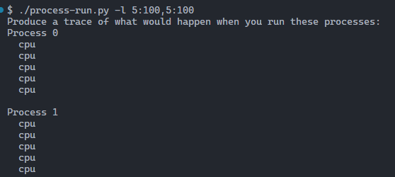
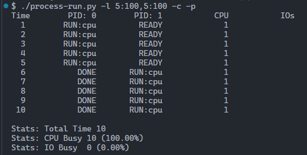

# Actividad de seguimiento - Simulación 1

|Integrante|Correo|Usuario Github|
|---|---|---|
|Brandon Duque Garcia|brandon.duque@udea.edu.co|brandugar|
|Jonathan Andrés Granda Orrego|jonathan.granda@udea.edu.co|JGranda11|

## Instrucciones

Antes de empezar a realizar esta actividad haga un **fork** de este repositorio y sobre este trabaje en la solución de las preguntas planteadas en la actividad de simulación. Las respuestas deben ser respondidas en español o si lo prefiere en ingles en el lugar señalado para ello (La palabra **answer** muestra donde).

**Importante**:
* Como la actividad es en las parejas del laboratorio, solo uno de los integrantes tiene que hacer el fork; y sobre repositorio bifurcado que se genera, la modificación se realiza en equipo.
* Como la entrega se debe hacer modificando el archivo READNE, se recomienda que consulte mas sobre el lenguaje **Markdown**. En el repo adjuntan dos cheatsheet ([cheat sheet 1](Markdown_Cheat_Sheet.pdf), [cheatsheet 2](markdown-cheatsheet.pdf)) para consulta rapida.
* Entre mas creativo mejor.

## Homework (Simulation)

This program, [`process-run.py`](process-run.py), allows you to see how process states change as programs run and either use the CPU (e.g., perform an add instruction) or do I/O (e.g., send a request to a disk and wait for it to complete). See the [README](https://github.com/remzi-arpacidusseau/ostep-homework/blob/master/cpu-intro/README.md) for details.

### Questions

1. Run `process-run.py` with the following flags: `-l 5:100,5:100`. What should the CPU utilization be (e.g., the percent of time the CPU is in use?) Why do you know this? Use the `-c` and `-p` flags to see if you were right.
   
   

   
Answer

   
La CPU esta siendo utilizada en todo momento, dado que tenemos 2 procesos y cada uno con el 100% de probabilidad de uso de CPU.
   Por tanto la CPU ejecuta las 5 instrucciones del primer proceso y el proceso 2 se encuentra en estado READY para luego usar la CPU.

      
   <code>process-run.py -l 5:100,5:100</code>

   
    
   
   `process-run.py -l 5:100,5:100 -c -p`
   
   

   

2. Now run with these flags: `./process-run.py -l 4:100,1:0`. These flags specify one process with 4 instructions (all to use the CPU), and one that simply issues an I/O and waits for it to be done. How long does it take to complete both processes? Use `-c` and `-p` to find out if you were right. 
   
   

   
Answer

   Ambos procesos se tardan ejecutando 11 unidades de tiempo, el primer proceso toma 4 unidades (todas en CPU), el segundo proceso tarda 7 unidades de tiempo 1 en RUN:io, otro en 
   RUN:io_done, y las 5 unidades restantes en estado BLOCKED

   `process-run.py -l 4:100,1:0`
   
   
   

3. Switch the order of the processes: `-l 1:0,4:100`. What happens now? Does switching the order matter? Why? (As always, use `-c` and `-p` to see if you were right)
   
   

   
Answer

      
   Ahora lo que pasa es que, como el primer proceso de la lista tiene un 0% de probabilidades de usar la CPU, hace la llamada a I/O y mientras este esta bloqueado la CPU se va a usar con el siguiente proceso, esto conlleva a que el tiempo de ejecución se reduzca, por que la CPU va a estar menos tiempo desocupada

   `process-run.py -l 1:0,4:100`
      
      

   

5. We'll now explore some of the other flags. One important flag is `-S`, which determines how the system reacts when a process issues an I/O. With the flag set to SWITCH ON END, the system will NOT switch to another process while one is doing I/O, instead waiting until the process is completely finished. What happens when you run the following two processes (`-l 1:0,4:100 -c -S SWITCH ON END`), one doing I/O and the other doing CPU work?
   
   

   
Answer

   En este caso el tiempo de ejecución no se va a optimizar, el proceso 1 de la lista va a esperar las 5 unidades de tiempo que demora la operación I/O y ningún otro proceso se va a ejecutar, sin importar que la CPU este desocupada el segundo proceso va a estar en estado de READY hasta que el primer proceso haya terminado.

      `./process-run.py -l 1:0,4:100 -c -p  -S SWITCH_ON_END`

      

   

6. Now, run the same processes, but with the switching behavior set to switch to another process whenever one is WAITING for I/O (`-l 1:0,4:100 -c -S SWITCH ON IO`). What happens now? Use `-c` and `-p` to confirm that you are right.
   
   

   
Answer

   Para este caso se optimiza el tiempo de ejecución, el tiempo de ejecución pasa de 11 a 7 unidades de tiempo,asi mismo el porcentaje de uso de la CPU aumenta a un 85.71% 
    

   `./process-run.py -l 1:0,4:100 -c -p -S SWITCH_ON_IO`
   
   

   

7. One other important behavior is what to do when an I/O completes. With `-I IO RUN LATER`, when an I/O completes, the process that issued it is not necessarily run right away; rather, whatever was running at the time keeps running. What happens when you run this combination of processes? (`./process-run.py -l 3:0,5:100,5:100,5:100 -S SWITCH ON IO -c -p -I IO RUN LATER`) Are system resources being effectively utilized?
   
   

   
Answer

   Lo que ocurre es que el proceso que implica 3 instrucciones de I/O debe esperar para ejecutarse, al ejecutar el primer llamado de I/O cuando pasa a estado de BLOCKED se aprovecha el uso de la CPU ejecutandose el resto de procesos, una vez ejecutados estos procesos, volvemos a realizar el segundo llamado I/O, dado que no hay procesos restantes se desaprovechan las 10 unidades de tiempo restantes, lo que nos lleva a concluir que no se utilizan eficazmente los recursos.

      `./process-run.py -l 3:0,5:100,5:100,5:100 -S SWITCH ON IO -c -p -I IO RUN LATER`
   
     

   

8. Now run the same processes, but with `-I IO RUN IMMEDIATE` set, which immediately runs the process that issued the I/O. How does this behavior differ? Why might running a process that just completed an I/O again be a good idea?
   
   

   
Answer

   Para este caso el tiempo de ejecucion se optimiza de muy buena manera, ya que la CPU esta siendo utilizada el 100% de la ejecución. Por tanto la idea de volver de inmediato al proceso que completa la operación I/O es rotundamente exitosa
   

   `./process-run.py -l 3:0,5:100,5:100,5:100 -S SWITCH_ON_IO -c -p -I IO_RUN_IMMEDIATE`
      
   

   

    

### Criterios de evaluación
- [x] Despligue de los resultados y analisis claro de los resultados respecto a lo visto en la teoria.
- [x] Creatividad y orden.
